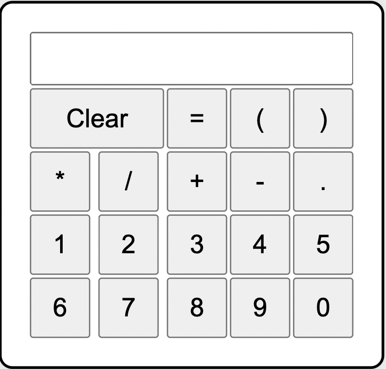

# Online Calculator

## Description
This is a simple online calculator web application built using HTML.

## Setup
To run this project locally, follow these steps:

1. Download the HTML file: Download the `online_calculator.html` file from the GitHub repository to your local machine.

2. Open in a web browser: Open the downloaded `online_calculator.html` file in a web browser.

## Execution
- Once the HTML file is opened in the web browser, the calculator interface will be displayed.
- Use the buttons to perform calculations such as addition, subtruction, division and multiplication.
- Click on the equal sign to see the results. This calculator works the same way any online basic calculator works. 

## Screenshot

